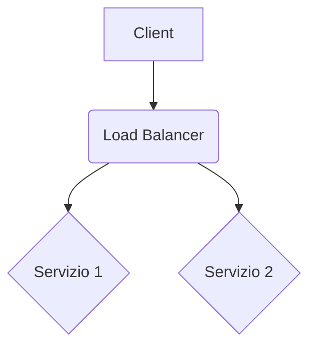

# itsiae/allocazione-analitica-engine

<!-- 
    SUGGERIMENTO: Aggiungi qui dei badge per visualizzare lo stato delle pipeline, la licenza, etc.
    Esempi:
    
    
-->

> [INSERIRE QUI UNA BREVE DESCRIZIONE (1-2 FRASI) DELLO SCOPO DEL PROGETTO]

In generale il nome del progetto è il medesimo del repository, per cui puoi utilizzare il nome del repository come titolo principale. Se il progetto è parte di una struttura o rimanda ad altri, puoi includere il nome delle altre repository con i link in una sezione dedicata.

---

## 📚 Indice

- [Panoramica](#-panoramica)
- [✨ Funzionalità Principali](#-funzionalità-principali)
- [🛠️ Prerequisiti](#️-prerequisiti)
- [🚀 Come Iniziare](#-come-iniziare)
  - [Configurazione Iniziale](#configurazione-iniziale)
  - [Utilizzo del Makefile](#utilizzo-del-makefile)
- [📂 Struttura del Progetto](#-struttura-del-progetto)
- [🔄 Flusso CI/CD](#-flusso-cicd)
- [🤝 Contribuire](#-contribuire)
- [🛡️ Sicurezza](#️-sicurezza)
- [⚖️ Licenza](#️-licenza)

---

## 📖 Panoramica

[INSERIRE QUI UNA DESCRIZIONE DETTAGLIATA DEL PROGETTO. Spiega cosa fa, a quale dominio appartiene, quali tecnologie principali utilizza e qual è il suo obiettivo finale. Questa sezione è fondamentale per chiunque si avvicini al repository per la prima volta.]

---

## ✨ Funzionalità Principali

- **Struttura Terragrunt DRY**: Organizzazione chiara con separazione tra moduli riutilizzabili (`modules`) e configurazioni di ambiente (`live`).
- **Automazione CI/CD**: Pipeline GitHub Actions pronte all'uso per `plan` e `apply` su diversi ambienti (Collaudo, Certificazione, Produzione).
- **Gestione Semplificata**: `Makefile` per astrarre i comandi Git e triggerare le pipeline con semplici comandi (`make plan_dev`, `make qa`, etc.).
- **Configurazione Centralizzata**: Gestione delle variabili globali e di ambiente tramite file YAML (`config.yaml`, `_envs/*.tmpl`).
- **Sicurezza Integrata**: Policy di sicurezza, `.gitignore` robusto e gestione sicura dello state di Terraform.

---

## 🛠️ Prerequisiti

Prima di iniziare, assicurati di avere installato i seguenti strumenti:

- [AWS CLI](https://aws.amazon.com/cli/)
- `make`
- `git`
- [Terraform](https://www.terraform.io/downloads.html)
- [Terragrunt](https://terragrunt.gruntwork.io/docs/getting-started/install/)

Per un'esperienza di sviluppo ottimale, si consiglia di utilizzare un ambiente UNIX-like (Linux, macOS o WSL su Windows).

---

## 🚀 Come Iniziare

### Configurazione Iniziale

1.  **Clona il repository**:
    ```bash
    git clone [URL_DEL_TUO_REPOSITORY]
    cd [NOME_DELLA_CARTELLA]
    ```

2.  **Configura il progetto**:
    Modifica il file [`config.yaml`](config.yaml) per impostare le variabili globali del tuo progetto, come `repository_name`, `project_name` e i tag di default.

3.  **Configura gli ambienti**:
    Personalizza i file template in [`live/_envs/`](live/_envs/) (es. `dev.tmpl`, `qa.tmpl`) per definire le variabili specifiche per ogni ambiente.

### Utilizzo del Makefile

Questo repository utilizza un [`Makefile`](Makefile) per semplificare l'interazione con le pipeline remote. I comandi non eseguono Terraform localmente, ma gestiscono i tag Git per attivare i workflow su GitHub Actions.

-   **Mostra i comandi disponibili**:
    ```bash
    make help
    ```
-   **Esegui un `plan` per l'ambiente di collaudo**:
    ```bash
    make plan_dev
    ```
-   **Esegui un `deploy` per l'ambiente di certificazione**:
    ```bash
    make qa
    ```

---

<!-- SEZIONE: ARCHITETTURA (Opzionale) -->
<!-- Se il tuo progetto ha un'architettura complessa, puoi descriverla qui. -->
<!-- Altrimenti, puoi cancellare questa sezione. -->

## 🏗️ Architettura

[INSERIRE QUI UNA DESCRIZIONE DELL'ARCHITETTURA. Puoi includere diagrammi (es. con Mermaid.js o immagini), descrivere i componenti principali e come interagiscono tra loro. Questo aiuta a comprendere il "perché" dietro le scelte implementative.]


<!-- FINE SEZIONE: ARCHITETTURA -->

---

## 📂 Struttura del Progetto

La struttura del repository è progettata per essere scalabile e manutenibile. Per una descrizione dettagliata di ogni cartella e file, consulta la [guida alla struttura del progetto in `CONTRIBUTING.md`](.github/CONTRIBUTING.md#--struttura-di-una-repository).

---

## 🔄 Flusso CI/CD

Il deploy è gestito interamente tramite **GitHub Actions**. Il flusso di lavoro si basa sui **tag Git**:

1.  Uno sviluppatore esegue un comando `make` (es. `make dev`).
2.  Il `Makefile` crea e sposta un tag specifico (es. `COLLAUDO`) sull'ultimo commit.
3.  Il push del tag attiva il workflow corrispondente in `.github/workflows/`.
4.  La pipeline esegue il `plan` e/o `apply` di Terragrunt sull'ambiente AWS target.

Il deploy in **produzione** è intenzionalmente manuale e richiede un'attivazione esplicita dall'interfaccia di GitHub Actions per maggiore sicurezza.

---

## 🤝 Contribuire

Siamo felici di ricevere contributi! Prima di iniziare, per favore leggi la nostra guida per i contributori.

➡️ **[Guida per Contribuire (`CONTRIBUTING.md`)](.github/CONTRIBUTING.md)**

---

## 🛡️ Sicurezza

La sicurezza è una priorità. Abbiamo definito una policy per la gestione delle vulnerabilità e le best practice da seguire.

➡️ **[Security Policy (`SECURITY.md`)](.github/SECURITY.md)**

---

## ⚖️ Licenza

Questo progetto è distribuito sotto una licenza proprietaria. Tutti i diritti sono riservati.

➡️ **[Dettagli della Licenza (`LICENCE.md`)](LICENCE.md)**
